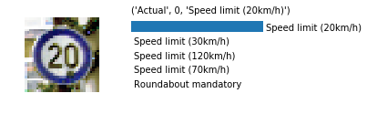

# **Traffic Sign Recognition** 

## Writeup

---

**Build a Traffic Sign Recognition Project**

The goals / steps of this project are the following:
* Load the data set (see below for links to the project data set)
* Explore, summarize and visualize the data set
* Design, train and test a model architecture
* Use the model to make predictions on new images
* Analyze the softmax probabilities of the new images
* Summarize the results with a written report

## Rubric Points
### Here I will consider the [rubric points](https://review.udacity.com/#!/rubrics/481/view) individually and describe how I addressed each point in my implementation.  

---
### Writeup / README

#### 1. All the Rubric points are addressed as follows and here is a link to my [project code](https://github.com/vishalmahulkar/Traffic_Sign_Classifier)

### Data Set Summary & Exploration

#### 1. I used a combination of numpy and pandas libraries to identify the basic attributes of the dataset. I also created some custom python functions to visualize the data set.

Following is the summary statistic:

* The size of training set is 34799
* The size of the validation set is 4410
* The size of test set is 34799
* The shape of a traffic sign image is (32, 32, 3)
* The number of unique classes/labels in the data set is 43

#### 2. Following image shows examples of images in the dataset.

### Design and Test a Model Architecture

#### 1. Data Preprocessing

I used two main pro-processing steps:

1. Normalizing the images so that they pixel values are between -0.5 and 0.5
2. Equalizing all the 3 channels so that the brightness effect is removed

The result of normalization is shown below:

The result of equalization is below. 

There is not visible difference at this stage but when the above two operations are performed in series, the difference becomes apparent

I also introduced transformation of existing training data set to allow generation of additional training images. The transformation consisted of rotation, translation and shear as seen below. This is to account for view angle while picture are taken. The maximum rotation angle is limited to 20 degrees because larger rotation angles might result in some signs looking similar and confusing the training algorithm. The shear and translation are limited to 5 pixels.

I decided to generate additional data using transformed images to compensate for the small size of the training data. The additional data was generated using the transformation above. 5 additional images were generated for each training image.

#### 2. Describe what your final model architecture looks like including model type, layers, layer sizes, connectivity, etc.) Consider including a diagram and/or table describing the final model.

My final model consisted of the following layers:

| Layer         		|     Description	        					| 
|:---------------------:|:---------------------------------------------:| 
| Input         		| 32x32x3 RGB image   							| 
| Convolution 1x1     	| 1x1 stride, same padding, outputs 32x32x3 	|
| RELU					|												|
| Convolution 5x5     	| 1x1 stride, same padding, outputs 32x32x16 	|
| RELU					|												|
| Convolution 1x1     	| 1x1 stride, same padding, outputs 32x32x32	|
| RELU					|												|
| Max pooling	      	| 2x2 stride,  outputs 16x16x32 				|
| Convolution 1x1     	| 1x1 stride, same padding, outputs 16x16x32 	|
| RELU					|												|
| Convolution 5x5     	| 1x1 stride, same padding, outputs 16x16x64 	|
| RELU					|												|
| Convolution 1x1     	| 1x1 stride, same padding, outputs 16x16x128	|
| RELU					|												|
| Max pooling	      	| 2x2 stride,  outputs 8x8x128 				|
| Convolution 1x1     	| 1x1 stride, same padding, outputs 8x8x128 	|
| RELU					|												|
| Convolution 5x5     	| 1x1 stride, same padding, outputs 8x8x256 	|
| RELU					|												|
| Convolution 1x1     	| 1x1 stride, same padding, outputs 8x8x256	|
| RELU					|												|
| Max pooling	      	| 2x2 stride,  outputs4x4x256 				|
| Flatten | Output 4096 |
| Fully connected		| Output 1024        									|
| RELU					|												|
| Dropout | p=0.5 |
| Fully connected		| Output 256        									|
| RELU					|												|
| Dropout | p=0.5 |
| Softmax				| Output 43        									|
 
The 1x1 convolution layers are used to increase the depth without significantly increasing the comuptational costs.

The output of the last layer is flattened for connection to a fully connected layer. It is possible to have many different architectures and add complexity through inception modules and so on. But here I just chose this architecture once the validation accuracy exceeded 98%.

The two fully connected layers have 50% drop outs layer after each to prevent over fitting. This is finally connectd to the output layer with 43 outputs for the 43 classes.

The test accuracy reached was 96.8%.

#### 3. Model details

- __Hyperparameters__: Chose a learning rate of 1e-3 with L2 regularization coefficient of 1e-6. A batch size of 100 for a total of 22 Epochs
- __Optimization__ : I used adamoptimizer with default settings for optimization.

#### 4. Approach

I started with the Lenet architecture with gave me 80% validation accuracy at the outset without any modification to the images. Preprocessing the images improved the accuracy to about 92%. After this I started tweaking the hyper parameters to see if I can gain any improvement. This was the most inefficient part of the process - essetially tuning some parameters to gain some improvement in performance. Soon I abandoned this and started focusing on the network architecture. Literature suggested having 3 layers to identify features from basic shapes like lines to more advanced features. The lectures also suggested using 1x1 filter convolutions to increase depth without incurring computational penalties. This was used to come up with the architecture described above.

There are a lot of knobs to turn here to gain small improvements here and there, but once I got the validation accuracy above 98% I stopped fiddling with the structure and the hyper parameters.

My final model results were:
* validation set accuracy of 98.5%
* test set accuracy of 96.8% 

### Test a Model on New Images

#### 1. Choose five German traffic signs found on the web and provide them in the report. For each image, discuss what quality or qualities might be difficult to classify.

Here are five German traffic signs that I found on the web:

The first image might be difficult to classify because there is a large red area and there is dominant line at the bottom which may cause the network to classify it as a stop sign.

#### 2. Discuss the model's predictions on these new traffic signs and compare the results to predicting on the test set. At a minimum, discuss what the predictions were, the accuracy on these new predictions, and compare the accuracy to the accuracy on the test set (OPTIONAL: Discuss the results in more detail as described in the "Stand Out Suggestions" part of the rubric).

Here are the results of the prediction:

| Image			        |     Prediction	        					| 
|:---------------------:|:---------------------------------------------:| 
| Keep right      		| Stop sign   									| 
| Speed limit 20km/h      			| Speed limit 20km/h 										|
| No passing for vehicles over 3.5 metric tons				| No passing for vehicles over 3.5 metric tons											|
| Beware of ice/snow	      		| Beware of ice/snow					 				|
| Go straight or right		| Go straight or right      							|

The model was able to correctly guess79.1% of signs. This is significantly lower than test set accuracy of 96.8%

#### 3. The soft max probabilities are in the image below:

